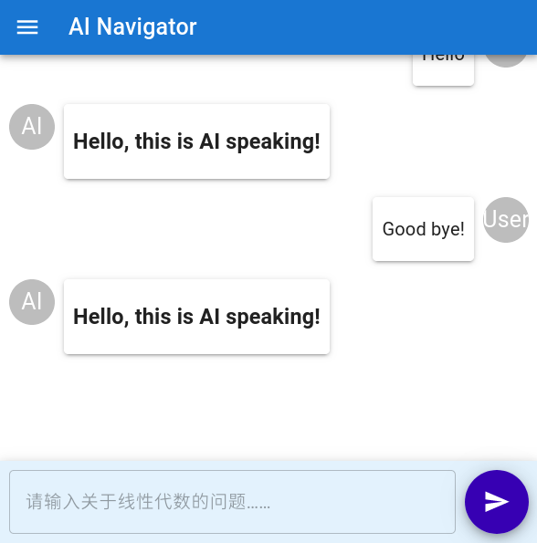

# AI Navigator Web

## Introduction

This is the frontend of AI Navigator Project (AI 线性代数助教). Featuring a simple chat UI and history stored in Local Storage.

## Features

- [X] Markdown
    - [X] Code Highlight
    - [X] Math
- [X] History Local Storage
- [ ] Multi-backend support
- [ ] Streaming content

## Demo



## Usage

We recommend using [nvm](https://github.com/nvm-sh/nvm) to manage versions of Node.js and [pnpm](https://pnpm.io/) to manage packages.

```sh
$ nvm use 20
$ pwd
/path/to/repo
$ pnpm install
$ pnpm run dev
```

Don't forget to modify URLs in `app/api/ask/route.tsx` and `app/page.tsx`.

## Technology Stack

React + Next.js + Material UI
